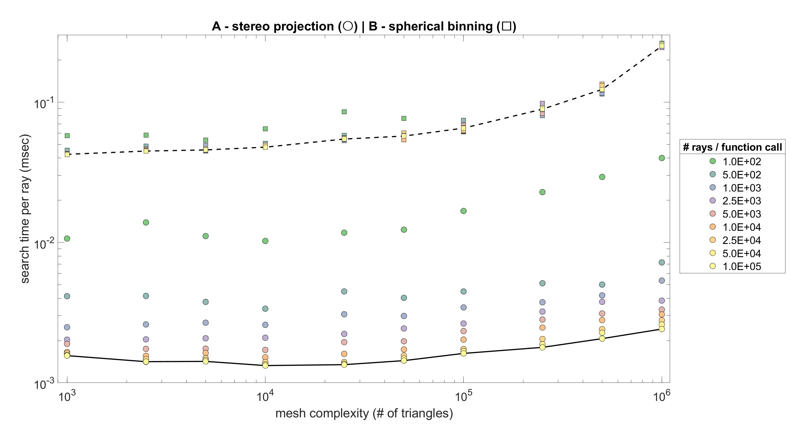

# S^2 Particle Tracking

The functions contained in this package perform particle tracking and ray-triangle intersection queries
on triangular surface meshes of a unit sphere (S^2), and can be readily incorporated into applications
that need to perform fast, simultaneously tracking of thousands of particles. Some examples of
applications where I have used these functions are:

  - Reparameterization of closed genus 0 surface meshes for nonrigid surface registration
  - Interpolation of S^2 vector and scalar fields 
  - Numerical integration  

## Description of Main Functions  

The two main functions:

	a. `SphericalTriangleIntersection_UsignStereoProj`
	b. `SphericalTriangleIntersection`

are built around Möller & Trumbore ray-triangle intersection algorithm [[1]], with additional
modifications which produce substantial speed-up when thousands or even millions of repeated 
queries are performed relative to a fixed spherical mesh. Significant effort went into optimizing
performance by:

- removing computational overhead by precomputing "static" variables that would otherwise have to be
recomputed during every call to the main functions, and

- using space partitioning methods to reduce the number of ray-triangle intersection tests 

I experimented with two different approaches for partitioning the sphere using (a) overlapping charts and (b)
spherical grids, each corresponding to a different function (see above). The first of these uses
nearest-neighbor search and exploits the built-in [`pointLocation`] function to assign particles/rays 
to mesh triangles stereographically mapped onto a plane (see `SphericalTriangleIntersection_UsignStereoProj.m`), 
while the second attempts to improve performance by reducing the number of ray-triangle intersection
tests using binning (see `SphericalTriangleIntersection.m`). In order to speed-up the the queries, both
functions employ auto-generated data structures which they re-use during subsequent functional calls.

Benchmark tests (see `s2_ray_triangle_intersection_benchmark_test.m`) revealed that
`SphericalTriangleIntersection_UsignStereoProj.m` is the fastest (up to 60 times) of the two functions
and that the gap in performance of the two functions increases with increasing number of simultaneous
positional queries and complexity of the mesh. Here are the performance curves of the two functions
(based on i7-4940MX CPU, 32 GB RAM, R2020a Matlab):

## Dependencies

The main functions require [S2 Sampling Toolbox] to work. Before using the main functions make sure to
download the [S2 Sampling Toolbox] and add it to your Matlab path.

## Example
 
Given a triangular surface mesh representation of a unit sphere and a set of points on a unit sphere (or equivalently, a set of
rays emanating from the origin), the functions (a) and (b) return list of triangles containing the queried points
along with the corresponding planar and spherical barycentric coordinates [[2]]. This information, for example, can be used to 
evaluate values of piecewise linear functions defined at the mesh vertices. The function `s2_particle_tracking_demo`
illustrates the use of (a) and (b) for integrating trajectories of particles immersed in randomly generated velocity fields.
  

## References

[[1]] Möller, T., Trumbore, B. (1997) '[Fast, minimum storage ray-triangle intersection]', Journal of Graphics Tools, Vol. 2, pp. 21-28.

[[2]] Langer, T., Belyaev, A., Seidel, H-P. (2006) '[Spherical barycentric coordinates]', In Proceedings of the 4th Eurographics Symposium on Geometry Processing (SGP 2006), pp.81–88. 

## License
[MIT] © 2021 Anton Semechko (a.semechko@gmail.com)

[1]: https://www.graphics.cornell.edu/pubs/1997/MT97.pdf
[2]: https://domino.mpi-inf.mpg.de/intranet/ag4/ag4publ.nsf/a58289c9ff876be5c125675300686234/9144c5ff262d3f9cc12571be00348ddf/$FILE/paper.pdf
[`pointLocation`]: https://www.mathworks.com/help/matlab/ref/triangulation.pointlocation.html
[S2 Sampling Toolbox]: https://github.com/AntonSemechko/S2-Sampling-Toolbox
[Fast, minimum storage ray-triangle intersection]: https://www.graphics.cornell.edu/pubs/1997/MT97.pdf
[Spherical barycentric coordinates]: https://domino.mpi-inf.mpg.de/intranet/ag4/ag4publ.nsf/a58289c9ff876be5c125675300686234/9144c5ff262d3f9cc12571be00348ddf/$FILE/paper.pdf
[MIT]: https://github.com/AntonSemechko/S2-Particle-Tracking/blob/master/LICENSE.md
